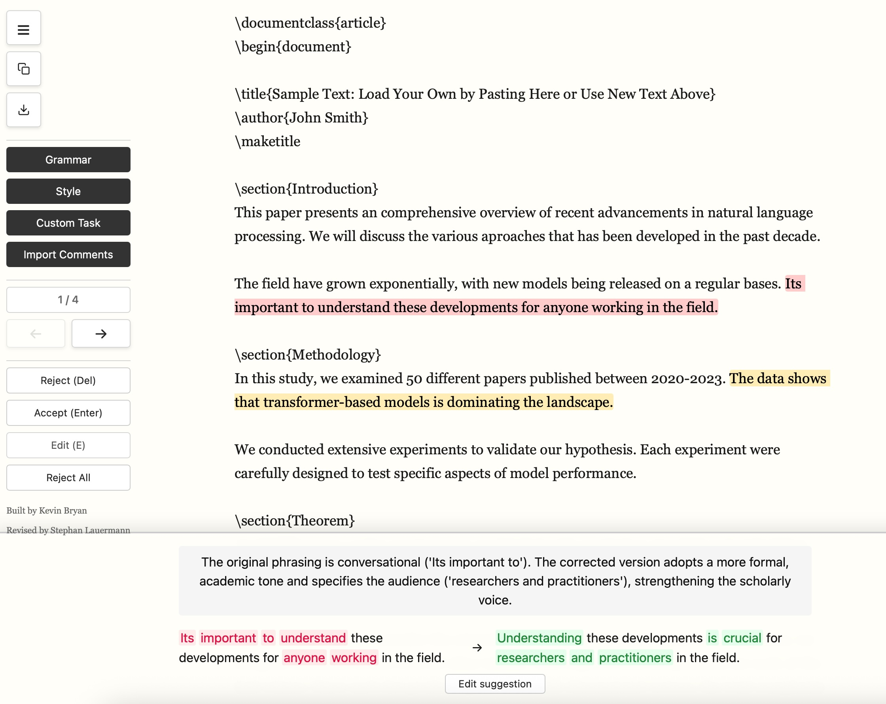

# ModernEditor (OpenAI GPT-5 port, MIT)

Original: Kevin Bryan (July 2025)  
Port/maintainer: Stephan Lauermann  

ModernEditor is a browser-based editor for LaTeX/Markdown/plain text with inline GPT-assisted editing using the OpenAI GPT family and Gemini. It runs grammar, style, simplification, and proof checks; it can also run Python to check math and search the web when enabled under GPT. You can accept/reject/edit each suggestion, and you can work fully offline by importing precomputed JSON corrections.

Warning: This code contains many insecure elements (see below). Do not use it with sensitive data.

---

## Quickstart
1) Open `index.html` in a modern browser. No build or server needed.  
2) API key (for live calls): open Menu → API keys / status… (session-only) or preload `window.OPENAI_API_KEY` / `window.OPENROUTER_API_KEY` / `window.GEMINI_API_KEY` in `keys.js`.  
   - The app prompts for the selected provider when you run a task without a key.  
   - Offline: skip the key and use Import → Structured JSON or the built-in Example.  
3) Load text: paste, or Menu → Load New Document (`.tex`/`.txt`).  
4) Run checks: left toolbar → Grammar, Style, or Custom Task.  
5) Apply suggestions: highlights appear inline; use arrow keys or buttons, edit if needed, then Enter to accept or Backspace/Delete to reject. Undo restores the prior state.

---

## Highlights & shortcuts
- Inline navigation: `←` / `→` previous/next; `Enter` accept; `Backspace/Delete` reject; `E` edit the suggested text; `Esc` exits editing.  
- `Ctrl/Cmd+S`: download a session snapshot (`.json`).  
- Shortcuts only hijack keys when corrections are active and focus isn’t in another input. Locked editor accepts shortcuts; real inputs keep normal behavior.

---

## What it can do
- Grammar & spelling: context- and LaTeX-aware; language selector (English variants, French, German, Spanish, Catalan, …).
- Format: selector for LaTeX (default), Markdown, or plain text to steer prompt handling.
- Style: built-in rules (e.g., academic style) plus custom instructions (scope/aggressiveness).  
- Selection tools: Simplify (3 brevity levels), Proof check (beta), Custom Ask on selected text.  
- LaTeX handling: full runs include the preamble so the model sees package/context; LaTeX commands/math are preserved. Selections send surrounding text as read-only context; you can optionally include the full document as an extra read-only context message.  
- Chunking/parallelism: set max chunk size; optionally run multiple chunks in parallel (OpenAI and OpenRouter; Gemini/Pro stay single-threaded).  
- Supporting files: attach PDFs/images/text as read-only context; plain text (markdown/latex) is preferred because PDFs are slower and more expensive. Large PDFs/images show a warning in the list. Attachments are skipped when chunking is active, so increase chunk size to include them (a warning appears in the loading overlay and console). Runs with supporting files show a confirmation listing files, sizes, and model settings, plus a brief toast after you continue. Supporting files are sent only with OpenAI; OpenRouter/Gemini skip attachments.  
- Models/tools: GPT-5.2 (thinking), GPT-5.2-pro, GPT-4.1-mini, and OpenRouter (account-default) are available. OpenAI/GPT-5.2 is the primary path by design; Gemini/Pro are supported where practical. GPT-5.2 can optionally enable web search and Python (default off). GPT-5.2-pro runs in single-step function-call output mode, so tools are disabled to preserve structured output reliability (Pro does not support `json_schema`). OpenRouter uses the OpenAI-compatible Responses API with structured outputs and no built-in tools. Token/cost info is shown in the menu’s run log (and also logged to the console).  
- Request timeout: optional menu setting to cap long runs; Off by default.
- Import/offline: Structured JSON corrections; Unstructured Comments → structured corrections; built-in Example to demo without API calls.  
- Diff/session: baseline tracking; Global Diff modal + download; autosave/session restore with backup + doc-only fallback; manual save/load `.json`; optional “Save checkpoint (local)”/restore for a browser-stored snapshot. Session snapshots include model/language/format/chunk size/parallel calls and tool toggles.
- Models: OpenAI (GPT-5.2 families, GPT-5.2-pro, GPT-4.1-mini) and Gemini (3 Flash preview, 2.5 Flash/Pro) share the same JSON schemas; tools (web/code) are OpenAI-only and disabled for GPT-5.2-pro.

---

## JSON contracts (for imports or running models elsewhere)
- Corrections schema (grammar/style/custom): one object with a `corrections` array of `{ original, corrected, explanation, type }`. Types: `grammar`, `style`, or `comment`. Empty = `{"corrections":[]}`. For `type: "comment"`, the editor never changes the text; the item is a note (no diff), so set `corrected` equal to `original`. Comment items are used for note-only guidance (e.g., comment imports and deep-audit non-local issues).  
- Simplify: `{ same_length, moderate, concise }` strings.  
- Proof: `{ is_valid, issues[], questions[], suggestions[], overall }`.  
- Custom Ask: `{ comment, suggestions[] }`.
- Gemini support: model selector includes Gemini 3 Flash (preview) and Gemini 2.5 Flash/Pro. Same JSON schemas apply; tools (web/code) remain OpenAI-only.

---

## Key handling
- Default path: enter key in the modal (session-only); the prompt targets the selected provider. See Help for import options.  
- OpenAI: set `window.OPENAI_API_KEY` or use `OPENAI_KEY_PATHS` for trusted local scripts.  
- OpenRouter: set `window.OPENROUTER_API_KEY` or use `OPENROUTER_KEY_PATHS`; optional attribution headers `OPENROUTER_HTTP_REFERER` / `OPENROUTER_X_TITLE` override the page origin defaults. Custom model IDs like `openai/gpt-5.2` or `openai/gpt-4.1` are supported.  
- Gemini: set `window.GEMINI_API_KEY` or use `GEMINI_KEY_PATHS` for trusted local scripts.  
- Manage: status bar/menu “Manage keys” handles all providers.  
- Offline: no key needed when importing JSON.

---

## Requirements
- Modern browser (Chrome/Firefox/Safari/Edge).  
- API key with access to chosen models for live calls; none needed for offline imports.

---

## Troubleshooting
- “API key is missing”: the modal opens for the selected provider; enter a key or switch to offline import.  
- “Autosave failed”: the status bar warns you; use “Save Session (.json)” or “Save checkpoint (local)” to secure a copy.  
- Diff: baseline is the first loaded/run document; view/download via Global Diff.  
- Gemini structured output rejected: simplify the schema (reduce nesting) and ensure your Gemini key is set; the app uses `responseJsonSchema` with the same schema as OpenAI.
- Gemini 3 Flash preview: model IDs and access can change; if you see "model not found," verify your key has preview access.
- See token/cost logs in the menu’s run log or the browser console.

---

## Insecure elements (known)
- API keys live in memory and can be optionally stored in localStorage with reversible obfuscation (not secure).
- Optional key “script” loading executes local JS files (use only on trusted local machines).
- Document text and snapshots are stored in localStorage/sessionStorage for autosave and session export.
- Run history (if enabled) persists prompts/responses in IndexedDB on this browser profile.
- Supporting file metadata is stored locally; attachments are sent to model providers as prompt context.
- No CSP or sandboxing is enforced when running as a plain HTML file.

---

## License
ModernEditor is released under the MIT License. See `LICENSE` for the full text; the VS Code extension ships with the same license.
